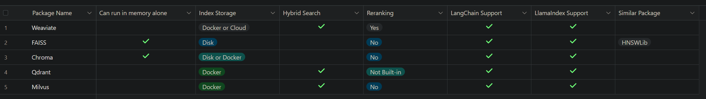

**1. Document Indexing (Vector Store)**

Weaviate, as a potential replacement, aligns with several key
requirements:

-   **Hybrid Search**: It offers hybrid search capabilities, which is a
    feature utilized in Azure AI Search. This means Weaviate can handle
    both keyword and vector-based searches.

-   **Reranking Capabilities**: Weaviate supports reranking, aligning
    with one of Azure AI Search\'s significant advantages. This feature
    allows for more accurate search results by adjusting the ranking
    after Hybrid Search.

-   **Deployment Flexibility**: Weaviate can be deployed using Docker or
    in the cloud, providing flexibility in hosting options. While it
    doesn\'t run in memory alone, its deployment options are suitable
    for edge device implementations.

-   **Compatibility with LangChain and LlamaIndex**: The support for
    these tools indicates that Weaviate is versatile and can integrate
    with various AI and NLP services, which is beneficial for AI-driven
    chatbot framework.

**2. Search Techniques (Querying)**

Azure AI Search was selected for its ability to execute different search
techniques, such as keyword, vector, hybrid, and hybrid with semantic
reranking, within the same index.

Weaviate aligns well with these requirements:

-   **Hybrid Search Support**: It supports hybrid search, which is
    crucial for maintaining the balance between keyword and similarity
    searches. This ensures searching on both explicit keywords and the
    semantic context of queries. In addition to the hybrid search  option,
    each individual search technique can be executed against the
    index.

-   **Reranking Feature**: With reranking capabilities, Weaviate can
    fine-tune search results, ensuring higher precision and
    relevance---key aspects that were valued in Azure AI Search.

**Conclusion**

Weaviate stands out as a strong candidate to replace Azure Search in
this project. It meets crucial requirements such as hybrid search and
reranking capabilities, offers flexibility in deployment, and is
compatible with key AI tools. This makes it a viable option for
deployment on edge devices, addressing the need to reduce reliance on
Azure while maintaining or enhancing the current functionalities of the
project.

